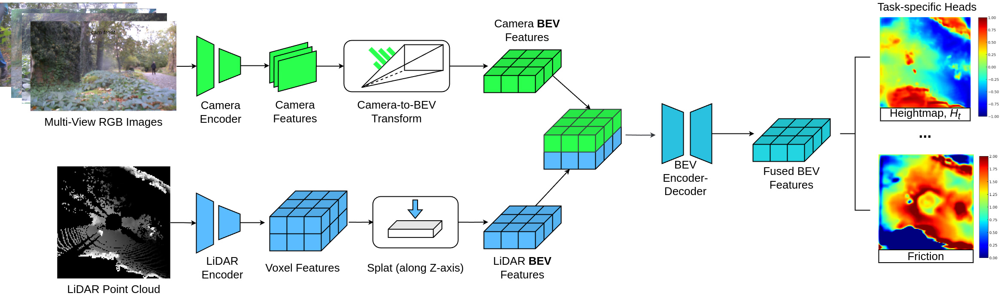

# FusionForce

[](https://arxiv.org/abs/2502.10156)
[](https://drive.google.com/drive/folders/1nli-4YExqcBhl0mPNRUjSiNecX4yIcme?usp=sharing)



## Citation

Consider citing the paper if you find the work relevant to your research:

```bibtex
@article{agishev2025monoforce,
  title={MonoForce: Learnable Image-conditioned Physics Engine},
  author={Agishev, Ruslan and Zimmermann, Karel},
  journal={arXiv preprint arXiv:2502.10156},
  year={2025},
  primaryClass={cs.RO},
  url={https://arxiv.org/abs/2502.10156},
}
```
